# catbot-agent


Let's llm do the things!

## Dev

```
cd cooker
npx wrangler dev
```

## Deploy

```
npx wrangler deploy
```

## Secret

```
# cooker
npx wrangler secret put GEMINI_API_KEY

# feeder
npx wrangler secret put PREDICTION_API_URL
https://catbot-cooker.foxfox.workers.dev/api/v1/predict
```

## TODO

- Get vibe from x.
- Post to discord
- Post to x
- Get graph with indicator

  ```
  curl -X 'POST' 'https://api.cloudflare.com/client/v4/accounts/7e11517c4dd4f6e9cede7da9b60d66eb/browser-rendering/screenshot' \
  -H 'Content-Type: application/json' \
  -H 'Authorization: Bearer KEY' \
  -d '{
  "url": "https://www.binance.com/en/trade/SOL_USDT",
      "viewport": {
      "width": 1640,
      "height": 960
      },
      "gotoOptions": {
      "waitUntil": "networkidle2",
      "timeout": 30000
      }
  }' \
  --output "screenshot.webp"
  ```

## Flow

```mermaid
graph LR;
  I(⏱️ cranker)--"1m trigger"--> A
  AA(🌼 binance)--"token prices"-->A
  AB(🌸 jupiter)--"positions"-->A
  A(🐝 cooker) --"chart 15m,1h,4h<br>ema,bb,mcad"-->B("🍯 storage")
  B --"sum_signals"-->C("🤖 feeder_llm") --"sum_signals<br>text+img"--> L1("💬 trader_discord")
  C--"sum_signals<br>text+img"--> O("🤖 trade_bot_vlm")
  O-->D(🌸 jupiter_perps)<--"positions"-->E("🤖 rebalance_llm")
  C--"sum_signals<br>text+img"-->E--"results"-->B
```



## Features

### Free

- See yesterday tab result via web.
- See today tab blurry result with `stake` button via web.
- Only one token.

### Staked

- See yesterday tab result via web.
- See today tab result via web.
- More token.
- See rebalance tab.
- Unstake took 7 days.
- Get role in Discord.
- Get circuit breaker signal.

## TODO

- [ ] Watch for 500k volume via websocket.
- [ ] Try vlm with graph.
- [ ] Trigger prediction every 5 minute.
- [ ] Store signals in KV/DO.
